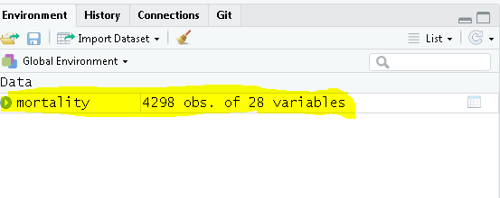
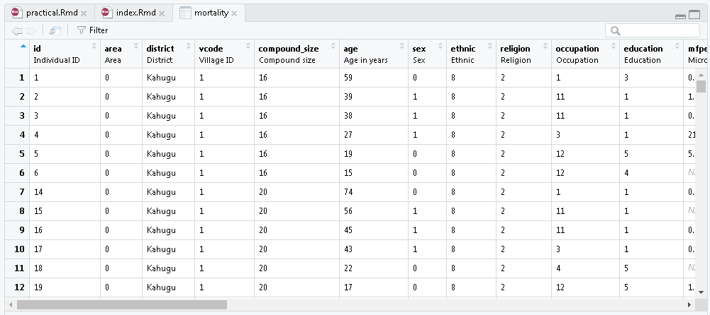

```{r setup, include=FALSE}
knitr::opts_chunk$set(echo = TRUE)
```

```{r include=FALSE}
library(haven)
mortality <- read_dta("dataset/mortality.dta")
```


## By the end of this practical, you will be able to:

- Use R to compare two or more groups in a crude analysis
-	Use R to estimate the effect (odds ratio) of one exposure, controlled for the effect of a second variable, and obtain a confidence interval for this odds ratio
-	Use logistic regression to assess if the effect of an exposure (e.g. visual impairment) is confounded by another variable (e.g. age)


## Follow the following steps: 
1. Ensure to download and store the data file into your PC from the link: [https://github.com/winterwang/logistic-reg-CSS/raw/gh-pages/dataset/mortality.dta](https://github.com/winterwang/logistic-reg-CSS/raw/gh-pages/dataset/mortality.dta)

2. Ensure you have installed [R](https://cloud.r-project.org/bin/windows/base/), [Rstudio](https://download1.rstudio.org/desktop/windows/RStudio-1.2.1335.exe), and the following packages by commands below: 

```{r eval=FALSE}
requiredPackages = c('haven','Epi','epiDisplay', 'tidyverse')
for(p in requiredPackages){
  if(!require(p,character.only = TRUE)) install.packages(p)
  library(p,character.only = TRUE)
}
```

3. If data is downloaded to your desktop, use the following command to read the data into R:

```{r eval=FALSE}
library(haven)
mortality <- read_dta("C:/Users/{YOUR.USER.NAME}/Desktop/mortality.dta")
```

4. If data is successfully loaded into R, you can see the dataname, number of variables, number of observations on the upper right side of the Rstudio program:



5. You may go ahead and explore the dataset as you wish by clicking on the name of the data, or by commands such as `summary()` or etc. to see more details of the data. 





```{r}
library(epiDisplay)
with(mortality, tabpct(mfgrp, died, graph = FALSE))
```


6. The outcome variable is `died`, which is coded as 1 for an individual who has died and 0 for an individual who is alive after 3 years of follow-up. Analyse this data set treating it as a cohort study with fixed follow-up time (ie., assume that all individuals were followed for the same length of time and analyse the data using odds). 


7.	To use logistic regression to examine the association between `died` and `vimp`, type
	
	

```{r}
vimp_logm0 <- glm(died ~ vimp, data = mortality, 
                  family = binomial(link = "logit"))
summary(vimp_logm0)
```

Check that the the output corresponds to that in the slides.  

Logistic regression estimates are derived by starting with a guess at the parameter estimates, then using the result to compute a better guess (nearer to the maximum likelihood estimates).  This is known as **iteration.**  The log likelihood for each iteration is shown.  The procedure stops when there is no further increase in the log likelihood.

8.	So far, all the output has been on the log scale.  This was needed in order to explain how confidence intervals and Wald tests (z-tests) are derived.  In fact, R allows us to derive estimates on the odds ratio scale, which is much more convenient for reporting results.  Type:

```{r, message=FALSE}
library(epiDisplay)
logistic.display(vimp_logm0, decimal = 3)
```

The results are now shown as odds ratios.  Note that:

-	The baseline term (intercept) represents the odds of outcome in the baseline group of the variable – so in this example it is the odds of death amongst those visually unimpaired.
-	The confidence interval is also derived using the standard error for the log odds ratio, as shown in the slides.  Hence, the confidence interval is correct.

9. Example of how results may be summarised in a sentence.


**“Visual impairment is strongly associated with risk of death (P<0.0001). Those visually impaired have nearly 6 times the odds of death compared to those with unimpaired vision (OR 5.57 95% CI: 3.78-8.20).”**

10. When tabulating variables for a cohort (or cross-sectional) study, use row percentages if the explanatory variable is the row variable, column percentages if it is the column variable. For example:

```{r}
with(mortality, tabpct(mfgrp, died, 
                       percent = "row", 
                       graph = FALSE))
```

We can then describe the risk of death over a 3 year period for those with no microfilarial infection (2.2%), <10 microfilarial load/mg infection (3.7%), etc.

11. As explained in the slides, we need to use indicator variables to examine the association between microfilarial load (4 levels) and death. We need to recode the varibales, type

```{r message=FALSE, warning=FALSE}
library(tidyverse)
mortality <- mortality %>% 
  mutate(mfgrp = factor(mfgrp)) %>% 
  mutate(mfgrp = fct_recode(mfgrp, 
                            "Uninfected" = "0", 
                            "< 10"       = "1",
                            "10-49"      = "2", 
                            "50+"        = "3"))

vimp_logm1 <- glm(died ~ mfgrp, data = mortality, 
                  family = binomial(link = "logit"))
summary(vimp_logm1)
```

12. 	To get the output on the odds ratio scale, type:

```{r}
logistic.display(vimp_logm1, decimal = 3)
```

Note that there are three odds ratios each of which refers to the same baseline group (those uninfected).  The odds ratio is
-	1.69 for those with microfilarial load <10 mf/mg (coded as 1) compared to those uninfected (coded as 0)
-	1.46 for those microfilarial load 10-49 mf/mg (coded as 2) compared to those uninfected (0) and 
-	2.05 for those microfilarial load ≥50 mf/mg  (coded as 3) compared to those uninfected (0). 

13. Write 2-3 sentences describing the relationship between microfilarial infection and death

There is weak evidence of an association between microfilarial infection (measured on 4 levels) and death (p=0.08). The risk of death among those uninfected is 2.2% which is lower than those infected. The odd ratios for those with <10, 10-49 and 50+ microfilarial /mg compared with being infected were 1.69 (95% CI: 1.08-2.64), 1.46 (0.88-2.41) and 2.05 (0.96-4.39), respectively.

14. Logistic regression model with agegrp as an explanatory variable:

```{r}
mortality <- mortality %>% 
  mutate(agegrp = factor(agegrp)) %>% 
  mutate(agegrp = fct_recode(agegrp, 
                            "15-34" = "0", 
                            "35-54"       = "1",
                            "55-64"      = "2", 
                            "65+"        = "3"))
vimp_logm2 <- glm(died ~ vimp + agegrp, 
                  data = mortality, 
                  family = binomial(link = "logit"))
logistic.display(vimp_logm2, decimal = 3)
```

There is strong evidence against the null hypothesis of no association of age with death (p<0.001). The odds of death increase with increasing age.